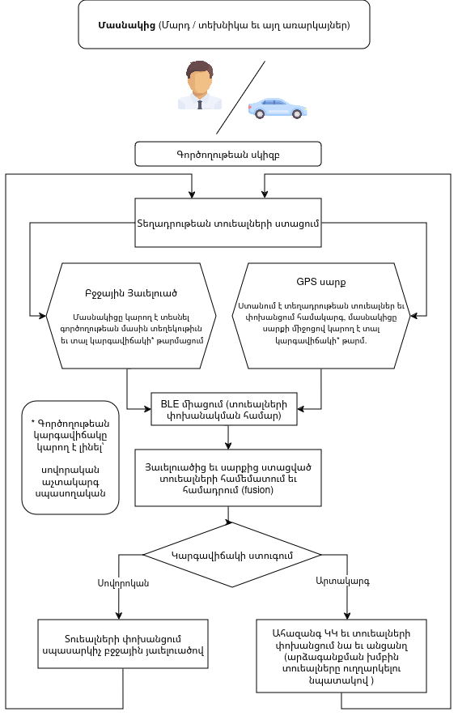
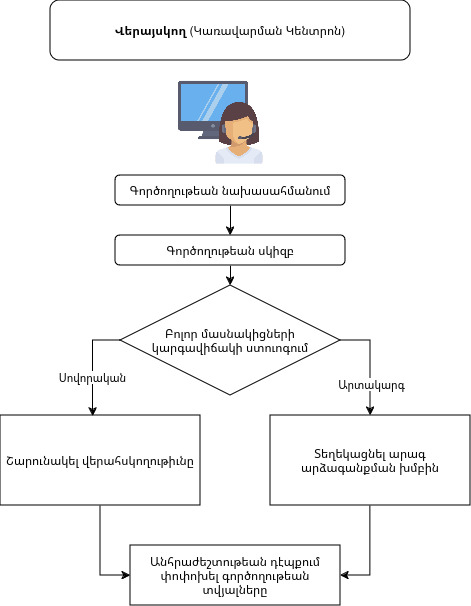
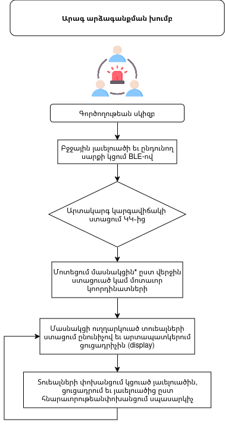
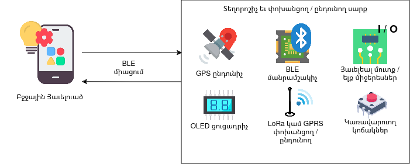

# Հետագիծ

## Իրական ժամանակում հետեւման համակարգ
**Նախագծի անուն:** Հետագիծ  
**Պատրաստող:** Ներսես Սարգսյան  
**Փաստաթղթի նպատակ:** Նախագծի պահանջների փաստաթութղթ  
**Փաստաթղթի կարգավիճակ:** Ընթացքում  
**Վերջին փոփոխութիւն:** 25 մարտ 2025  

---

## Բովանդակութիւն
1. [Ներածութիւն](#ներածութիւն)
   - [Փաստաթղթի մասին](#փաստաթղթի-մասին)
   - [Յղումներ](#յղումներ)
   - [Խնդրի դրուածք](#խնդրի֊դրուածք)
   - [Կարճ նկարագրութիւն](#կարճ-նկարագրութիւն)
   - [Աշխատանքի ընթացք](#աշխատանքի-ընթացք)
2. [Պահանջներ](#պահանջներ)
   - [Գործառութային պահանջներ](#գործառութային-պահանջներ)
3. [Համակարգի գծապատկեր](#համակարգի-գծապատկեր)

---

## Ներածութիւն

### Փաստաթղթի մասին
Այս փաստաթղթում սահմանուում են "Հետագիծ" նախագծի պահանջները։

### Յղումներ
- [1]

### Խնդրի դրուածք

Իրավիճակային իրազեկման համար կարեւոր է ընթացիկ գործողութիւնների կարգավիճակի՝ մանսաւորապէս իրական ժամանակում տեղակայման վերայսկումը։ Գործողութեան բոլոր մասնակից ադամների եւ առարկայների թարմացուող տուեալներ ունենանլը թոյղ է տալիս արդիւնաւէտ վերայսկել եւ իրազէկ լինել գործողութեան ընթացքին, տեղադրութիւնից կախուած մասնակիցներին ուղղորդումներ տալ, խնդիրների պարագայում նկատել եւ արձագանքել, ճիշտ բաշխել մասնակիցներին եւ կառավարել գործողութիւնը։ 

### Կարճ նկարագրութիւն
Հետագիծը իրական ժամանակում գործողութիւնների տեղադրութիւնը վերայսկելու համակարգ է, որը թոյղ է տալիս գործողութեան գործող անձանց կամ առարկայների գտնուելու վայրը շարունակաբար տեսնել քարտեզի վրայ։ Համակարգը նա եւ պէտք է աշխատի արտակարգ իրավիճակի (աւրինակ՝ մասնակցին շտապ դուրս բերելու (Evacuation)   անհրաժեշտության) դէպքում եւ միաժամանակ կարողանայ անցանց տարբերակով փոխանցել տեղադրութեան տուեալները, որը արագ արձագանքման խումբը կընդունի և կաւգտագործի։
Համակարգը բաղկացած է հետեւեալ մասնիկներց․

- **Բջջային Յաւելուած**
  - Նախատեսուած է տուեալների շարժուն ձեւով ցուցադրման համար, ինչպէս նա եւ սարքի հետ համագործակցելով ստանում եւ փոխանցում է տեղադրութեան տուեալները։
- **Տեղորոշիչ եւ փոխանցող / ընդունող սարք**
  - Ունի GPS ընդունիչ եւ ստանում է տեղադրության տուեալներ, նախատեսուած է գործողութեան մասնակցի (տուեալների փոխանցում) եւ արագ արձագանքման խմբի (տուեալների ընդունում) աւգտագործման համար։
Համակարգի կառուցուացքի, բաղադրիչների փոխգործակցութեան մասին մանրամասն ներկայացուած է [յաջորդ գլխում](#համակարգի-կառուցուածք)։

### Համակարգի կառուցուածք 
Ընդհանուր առմամբ համակարգը բաղկացած է հետեւեալ հիմնական բաղադրիչներից
   - Տեղադրութեան տուեալների ստացում
   - Տուեալների փոխանցում
   - Տուեալների ստացում եւ արտապատկերում
Համակարգի կառուցուածքի՝ բաղադրիչեների եւ դրանց փոխհամագործակցութեան համար դիտարկուել էն միքանի տարբերակեներ

   - **Միայն բջջային յաւելուածով** ֊ Կոորդինատների ստացման եւ սպասարկիչ ուղղարկման համար աւգտագործուում է խելախաւսի (smartphone) GPS եւ այղ աւժանդակ տուիչները՝ բջջային յաւելուածի միջոցով
      - Առաւելութիւններ 
         - Յարմար է մարդկանց հետեւելու համար
         - Կարող է ցուցադրել հաւելեալ տեղեկութիւն գործողութեան մասին
         - Ծախսարդիւնաւէտ
         - Չի պահանջում յաւելեալ սարքերի աւգտագործում
      - Թերութիւններ
         - Յատկացուած սարք չէ, եւ քանզի աւգտագործուում է բացի կոորդինատների ստացումից այղ նպատակներով, յուսալի չէ մարտկոցի խնայողութեան տեսանկիւնից
   - **Միայն տեղորոշիչ եւ փոխանցող սարքով** 
      - Առաւելութիւններ
         - Յարմարաւէտ աւգտագործում, յարմար է առարկայների՝ առանց մարդու միջամտութեան աւգտագործման համար
         - Ստացուած կոորդինատները [հիմնականում*](docs/res.md#smart-gps-comparison) աւելի ճշգրիտ են  
      - Թերութիւններ
         -  Կախուած կապի միջոցից կարող է պահանջել շարունակական ծախսեր (GPRS/GSM պարագայում)
         -  Բարդ/ժամանակատար իրականացում
   - **Յաւելուած + տեղորոշիչ սարք**
      - Առաւելութիւններ
         - Յաւելուածը տալիս է սարքի կառավարման յարմար միջերես ի տարբերութիւն նախորդ տարբերակի 
         - Հնարաւոր է համադրել երկու սարքից ստացուած կոորդինատները, բարձրացնելով ճշտութիւնը
         ֊ Կարող է ցուցադրել սարքից ստացուած տուեալները հաւելուածում, 
      - Թերութիւններ
         - Սարքի եւ յաւելուածի նախնական կցման անհրաժեշտութիւն     
   - **Համակցուած մաւտեցում** ֊ Սարքը կարող է հանդէս գալ եւ, որպէս առանձին սարք եւ բջջային հեռախոսի հետ։ Ուստի տուեալները փոխանցուում է երկու եղանակով՝ յաւելուածից համացանցով եւ սարքից *******
      - Առաւելութիւններ
         - Պարունակում է եւ յաւելուածի եւ առանձին սարքի իրականացման եղանակի առաւելութիւնները
         ֊ Հուսալի է, տուեալների փոխանցման եղանակներից մեկի խափանման ժամանակ մեւսը կփոխարինի
      - Թերութիւններ 
         - Պահանջում է ծաւալուն աշխատանք
           
Նշուած բոլոր եղանակներում տուեալները սպասարկիչ են ուղղարկուում եւ արտապատկերուում են կամ վեբ միջերեսում կամ յաւելուածում։ Նախատեսուած է, որ այդ միջերեսը միշտ հասանելի լինի կառավարման կենտրոնում։

Նախատեսուած է որ համակարգը պէտք է աշխատի բջջային յաւելուած + տեղորոշիչ եւ փոխանցող սարք տարբերակով 
       
 
### Աշխատանքի ընթացք
Համակարգը ունի երեք հիմնական դերակատար՝
1. **Մասնակից** – Վերահսկվող անձ, տեխնիկա կամ օբյեկտ։
2. **Վերահսկող** – Վերահսկող անձ ԿԿ-ում (կառավարման կենտրոնում)։
3. **Արագ արձագանքման խումբ** – Արտակարգ կարգավիճակ ստանալու դեպքում արձագանքող խումբ։

Իւրաքանչիւրի համար սահմանուած են առանձնայատուկ գործառոյթներ։

---
## Պահանջներ

### Գործառութային պահանջներ
Ստորև ներկայացված են բջջային հավելվածի պահանջները։

| Ցուցիչ | Նկարագրութիււն | [Առաջնահերթութիւն](#priority-matrix) |
|--------|--------------|----------------|
| MA-001 | Ըստ աւգտատերի հասանալիութեան գործողութիւնների եւ տուեալների ցուցադրում | M |
| MA-002 | Քարտեզի վրաj տուեալների արտապատկերում եւ փոփոխութեան հնարաւորութիւն | M |
| MA-003 | BLE սարքաւորման հետ կցման հնարաւորութեան հնարաւորութիւն | M |
| MA-004 | Գործողութիւնների որոնում եւ զտում (ըստ ամսաթուի, երթուղու եւ այլն): | C |
| MA-005 | GPS տուեալների ստացում հեռախոսի տուիչներից | M |
| MA-006 | Կցուած սարքի ուղղարկուած տվյալների ստացում եւ մշակում | M |
| MA-007 | Սարքից եւ հեռախոսից ստացուած տուեալների համադրում, ըստ ճշտութեան եւ ողարկում սպասարկիչ | S |

\* Առաջնահերթութիւնները սահմանուած են համաձայն հետեւեալ աղիւսակի, որը կապում է պահանջը դրա իրականացման համար անհրաժեշտ ռեսուրսը, իրականացման դէպքում ազդեցութիւնը եւ ռիսկերը։

### Համակարգի գծապատկեր
Համակարգի ճարտարապետության գծապատկեր։

### Սարքի գործառութային պահանջներ

| Ցուցիչ | Նկարագրութիւն | [Առաջնահերթութիւն](#priority-matrix) |
|--------|--------------|----------------|
| EP-001 | GPS ընդունող եւ մշակող մաս | M |
| EP-002 | BLE միացման հնարաւորութիւն | M |
| EP-003 | Ելքի / մուտքի միջերեսներ | S |
| EP-004 | GPRS կապի հնարաւորութիւն | S |
| EP-005 | LoRa կապի հնարաւորութիւններ | M |
| EP-006 | Տուեալների թարմացման եւ փոխանցման հաճախականութիւն առաւելագոյնը 10 վ | S |

[//]: # (Ուսումնասիրութեան ընթացքում ըստ սահմանուած պահանջների առանձնացուել են հետեւալ սարքաւորումները)

[//]: # (Մանրամասնել հետազոտութիւնը եւ ավելացնել հաւելեալ տեղեկութիւն)

---

Ժամանակացոյց

## Եզրակացություն
Այս փաստաթուղթը հանդիսանում է Հետագիծ իրական ժամանակում հետևման համակարգի մշակման հիմքը։ Հետագայում մանրամասները առաւել կը հստակեցուեն։
